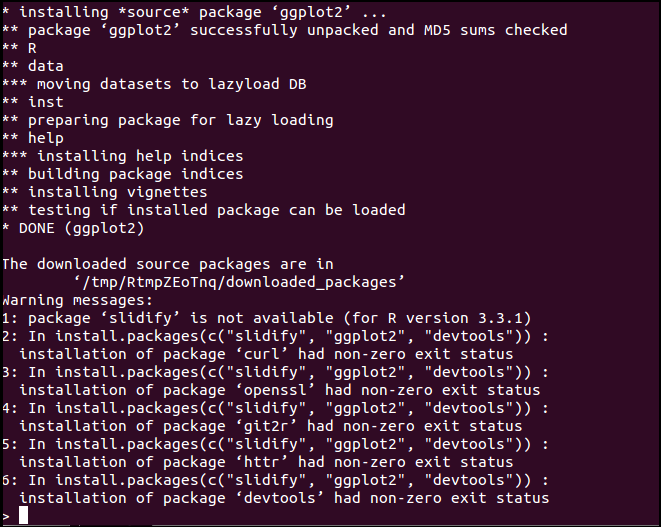

# Installing R and Obtaining R Packages

Date: 20th July, 2016

*For R 3.3.1 on Ubuntu 14.04*

## Installing R

If you're on Linux, this can be quite a pain to figure out yourself. Normally, one would try: 

```
$ sudo apt-get update
$ sudo apt-get install r-base r-base-dev
```

However, this installs a much older version of R, for me it was R 3.0.2 and it won't have a lot of packages you will want. To install the latest version, one has to use a [CRAN mirror](https://cran.r-project.org/mirrors.html) which is geographically closest to your location that will act as a source for the software. The Ubuntu Software centre only has an older version of R. You will also need to specify your Ubuntu version so that the appropriate bundle is installed from the CRAN mirron. You can do all of this by:

```
$ codename=$(lsb_releasr -c -s)
$ echo "deb http://ftp.iitm.ac.in/cran/bin/linux/ubuntu $codename/" | sudo tee -a /etc/apt/sources.list > /dev/null
```

This adds the CRAN mirror to your sources list and the latest version of R is installed from there. Two additional steps need to be followed: 

```
$ sudo apt-key adv --keyserver keyserver.ubuntu.com --recv-keys E084DAB9
$ sudo add-apt-repository ppa:marutter/rdev
```

Followed by:

```
sudo apt-get update
sudo apt-get upgrade
sudo apt-get install r-base r-base-dev
```

[Source](https://pythonandr.com/2015/04/27/upgrading-to-r-3-2-0-on-ubuntu/)


## Installing Packages

The command `install.packages()` is used to install packages in R.

```R
>install.packages("PackageName") #Installs package
>install.packages(c("slidify","ggplot2","devtools")) #Creates a character vector c and installs all packages within c
```

If you're using a more recent version of R, it might return an error message like `slidify is not available for R 3.3.1`. To fix this, we have to install `slidify` from **Github** on R using:

```R
> library(devtools)
> install_github('ramnathv/slidify') # Or install_github('slidify','ramnathv')
> install_github('ramnathv/slidifyLibraries') # Or install_github('slidifyLibraries', 'ramnathv') 
```
The commented option might return the "Username deprecated" error, which can be ignored or fixed using the uncommented part of the code. If this works, great! Else, you might get an issue like `no library "devtools" found` (Not the exact words). To fix this up, follow the next section. 

## Installing `devtools`
In R, use:

```R
$ install.packages("devtools") 
```

If this works, then you just have to use `install.packages("slidify")` to install `slidify` after `devtools` . However, trying to install `slidify` returned the following error for me:



I tried a number of things like `$ sudo apt-get install libssl-dev` but they didn't work for me again. The last thing that finally worked was: 

`$ sudo apt-get install libcurl4-openssl-dev`

So after this, all I had to do was to install `devtools` and `slidify` in the respective order. 


